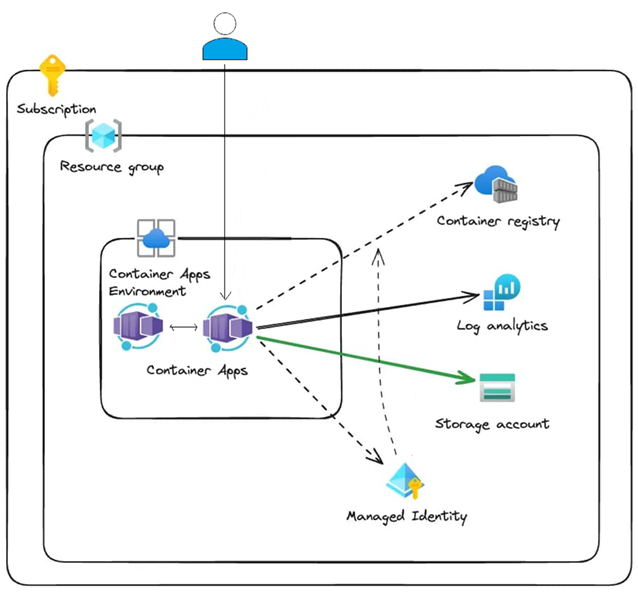

# Self-Hosting AI LLM Demo
 
Instructions used in the **Self-Hosting AI LLM** presentation. 
You will deploy an AI model using **Azure Container Apps** and supporting scripts included in this repository. 

## Prerequisites
- An Azure subscription
- Azure CLI
  - Run az version to find the version and dependent libraries that are installed. To upgrade to the latest version, run az upgrade
- Docker Desktop

## Instructions
Instructions under development branch.
They are not fully tested.
Once they are completed they will be posted here.

## Open a PowerShell Terminal

## Clone the Repository
git clone https://github.com/danielecolon/Azure-ContainerApps-Ollama.git

## Navigate into the project directory:
cd Azure-ContainerApps-Ollama 
cd demo

## Deploy Azure Container Apps Environment
.\ace.ps1

## Deploy the Ollama Container App
.\aca_ollama.ps1 -RANDOM <RANDOM_PROVIDED_FROM_PREVIOUS_SCRIPT>

## Update the Ollama Container App
The output of the previous script will include instructions on how to update the Ollama Container App to use the created fileshare

## Clone the open-webui Repository
git clone https://github.com/open-webui/open-webui.git

## Deploy the Web UI
.\aca_open-webui.ps1 -RANDOM <RANDOM_PROVIDED_FROM_PREVIOUS_SCRIPT>

## Cleanup
Delete the resource group that was created using the Azure Portal or run the following: 
Note:  This script will delete all resource groups with the tag status=='safe2delete' 
.\s2d.ps1